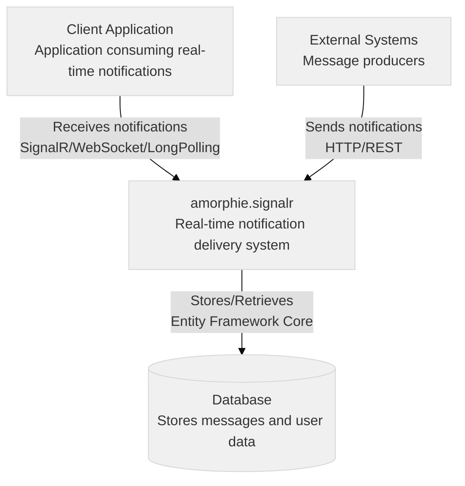
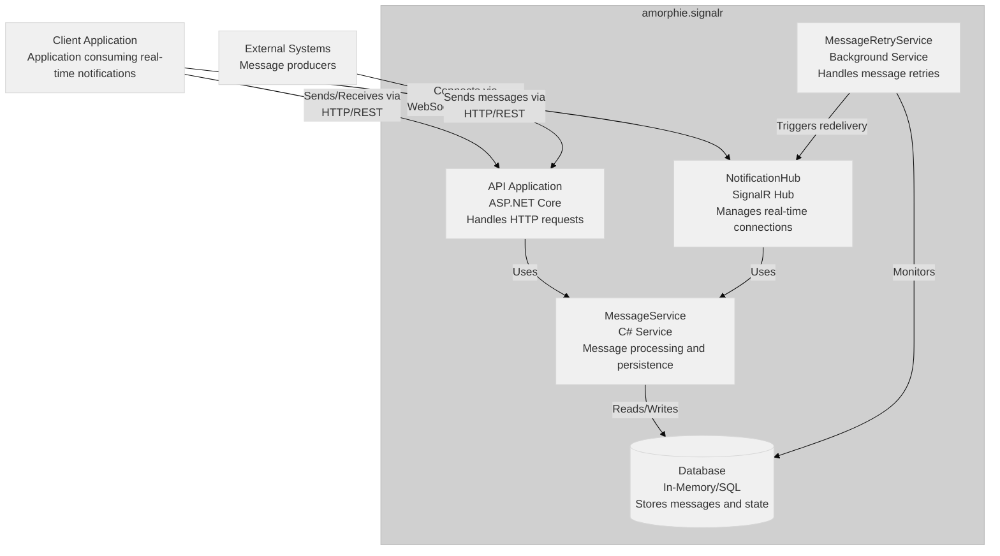
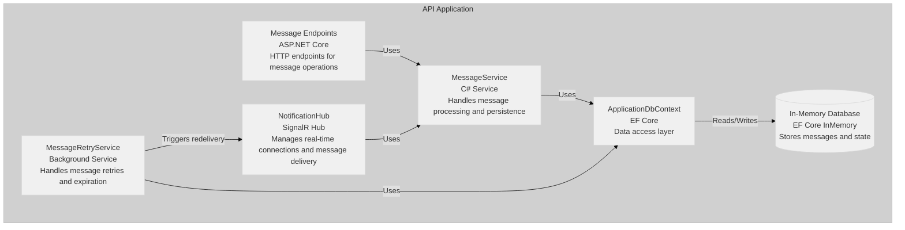
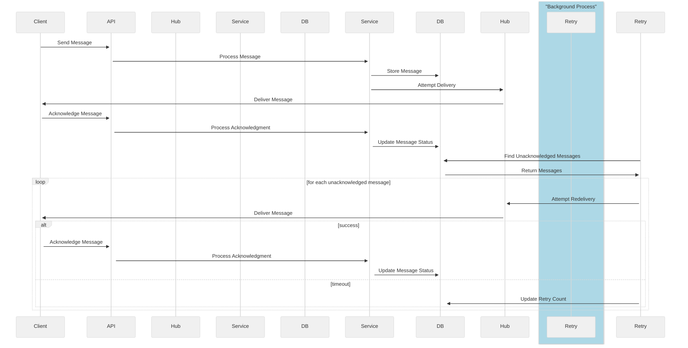
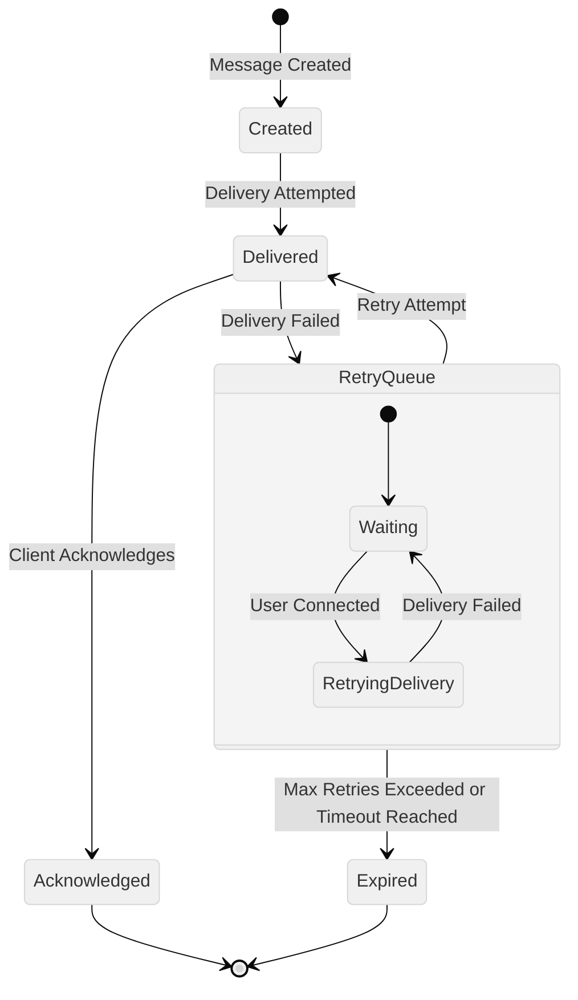

# amorphie.signalr - Real-time Notification System

## Overview

amorphie.signalr is a real-time notification system built using ASP.NET Core SignalR. It provides reliable message delivery with automatic retries, acknowledgment tracking, and fallback mechanisms.

## Architecture

### Core Components

1. **NotificationHub**

   - Manages real-time connections
   - Handles user connection/disconnection
   - Tracks connected users
   - Manages message delivery

2. **MessageService**

   - Handles message persistence
   - Manages message acknowledgments
   - Provides message retrieval
   - Implements retry logic

3. **MessageRetryService**

   - Background service for message redelivery
   - Handles expired messages
   - Implements retry policies
   - Monitors message states

4. **Data Model**
   - Messages with tracking capabilities
   - User management
   - Connection state management

### Key Features

- Real-time message delivery
- Automatic fallback to long polling
- Message persistence
- Delivery acknowledgment
- Automatic retry mechanism
- Message expiration handling
- Connection state management

### Technical Stack

- ASP.NET Core 8.0
- SignalR
- Entity Framework Core
- In-Memory Database (configurable)
- xUnit for testing

## C4 Diagrams

### System Context Diagram



`

### Container Diagram



### Component Diagram



### Message Flow Diagram



### Message State Diagram



## Implementation Details

### Message Configuration

```json
{
	"MessageSettings": {
		"DefaultMaxRetryAttempts": 3,
		"DefaultMessageTimeout": "24:00:00",
		"RetryInterval": "00:01:00"
	}
}
```

### Message Properties

```csharp
public class Message
{
    public string Id { get; set; }
    public string UserId { get; set; }
    public string Content { get; set; }
    public bool IsAcknowledged { get; set; }
    public DateTime Timestamp { get; set; }
    public DateTime? AcknowledgedAt { get; set; }
    public int RetryAttempts { get; set; }
    public int MaxRetryAttempts { get; set; }
    public TimeSpan MessageTimeout { get; set; }
    public bool IsExpired => !IsAcknowledged && DateTime.UtcNow > Timestamp.Add(MessageTimeout);
}
```

## Usage

### Client Connection

```csharp
var connection = new HubConnectionBuilder()
    .WithUrl("https://your-server/hubs/notification")
    .WithAutomaticReconnect()
    .Build();

connection.On<string, string>("ReceiveMessage", (messageId, content) => {
    Console.WriteLine($"Message received: {content}");
    // Acknowledge message
    await connection.InvokeAsync("AcknowledgeMessage", messageId);
});

await connection.StartAsync();
```

### Sending Messages

```csharp
// Via HTTP
await httpClient.PostAsJsonAsync("/messages/send", new {
    UserId = "user123",
    Content = "Hello!"
});

// Via Hub
await hubConnection.InvokeAsync("SendMessage", "user123", "Hello!");
```

### Message Acknowledgment

```csharp
// Via HTTP
await httpClient.PostAsync($"/messages/acknowledge/{messageId}", null);

// Via Hub
await hubConnection.InvokeAsync("AcknowledgeMessage", messageId);
```

## Testing

The project includes comprehensive tests covering:

- Connection scenarios
- Message delivery
- Retry mechanisms
- Fallback behavior
- Error handling

Run tests using:

```bash
dotnet test
```

## Error Handling

The system implements robust error handling:

- Connection failures trigger automatic reconnection
- Failed deliveries are retried based on configuration
- Messages expire after configured timeout
- All operations are logged for monitoring
- Fallback to long polling when WebSocket fails

## License

This project is licensed under the MIT License - see the LICENSE file for details.
